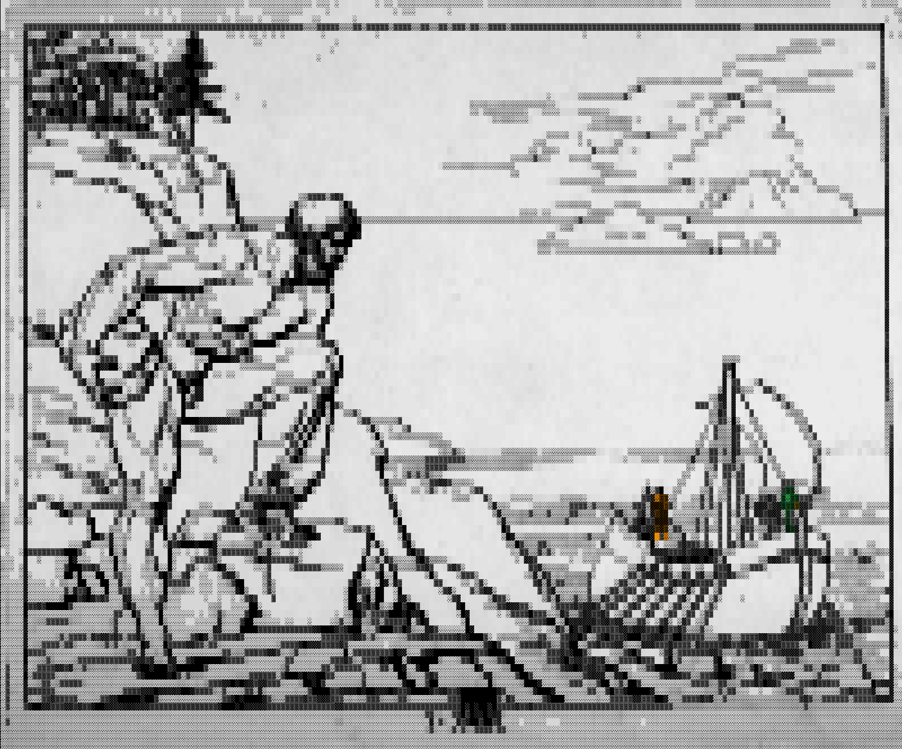

# Talos

A minimal LLM inference engine in Rust. Talos loads a GGUF model, runs a
Llama-style forward pass with a KV cache, and samples tokens — a tiny
`llama.cpp` written from scratch to understand how inference actually works.

It's the runtime half of a from-scratch loop: **train → forge GGUF → run**.
The companion project trains the model and exports the GGUF; Talos runs it.



> In myth, Talos was the bronze automaton forged by **Hephaistos** to guard
> Crete — the machine that runs what the smith made. Above: Asmus Jacob
> Carstens' engraving of Talos (public domain), rendered to colored block-ASCII
> with [ren-ascii-sance](https://github.com/Tsuskov/ren-ascii-sance).

## Status

M0–M6 implemented, plus grouped-query attention: GGUF reader, byte-BPE
tokenizer, math kernels, the Llama forward pass with a KV cache, sampling,
quantized inference, and a perplexity harness — all verified against the
trainer's logits. `cargo test` is green; `cargo bench` reports throughput.

M7 (opt-in, `--features metal`) is the matvec building block — F32 and fused
dequant for Q8_0/Q4_0 on the Apple GPU, verified against the CPU kernels
(`cargo test --features metal`).

M8.0 keeps each weight tensor resident on the GPU (uploaded once at first use,
keyed by name) instead of re-uploading it every call: **6.3×** over M7's per-call
upload on a 4096×4096 matvec (6.98 ms → 1.10 ms).

M8.1 makes the kernel one simdgroup per output row — lanes stride the row so
reads coalesce, then `simd_sum` reduces — taking the resident matvec to **0.79
ms** (1.4× over M8.0; `cargo bench --features metal -- matvec_4096`). Honest
caveat: that is still ~1.6× the rayon CPU path (0.50 ms). The remaining gap is
per-matvec command-buffer overhead (commit/wait on every call); closing it needs
one command buffer for the whole token (the rest of the forward pass on the GPU)
— M8.2.

M8.2 puts the **whole forward pass** on the GPU: `Model::forward_gpu` keeps the
residual stream and KV cache resident and encodes every op (rmsnorm, q/k/v
matvec, RoPE, attention, SwiGLU, output projection) into a single command buffer
per token, reading back only the logits. The kernels run in one *serial* compute
encoder, so Metal orders them with memory coherence — no inter-kernel races, no
manual barriers. The CPU `forward` stays the reference; `forward_gpu` matches it
to ~1e-7 over a multi-token GQA sequence and is bit-identical across runs
(`tests/forward_gpu.rs`, built only with `--features metal`). End-to-end decode
on the bench models (`cargo bench --features metal -- decode`, 64 tokens) the GPU
forward beats the rayon CPU path **2.8×** on F32 (664 → 1843 tok/s) and **3.7×**
on Q4_0 (617 → 2302 tok/s) — the single command buffer per token amortizes the
per-dispatch overhead that held M8.1 back.

| Milestone | What | Verify |
|-----------|------|--------|
| M0 | GGUF reader (mmap, metadata, tensor index) | `talos inspect model.gguf` lists every tensor + hyperparam |
| M1 | Byte-BPE tokenizer | `decode(encode(s)) == s` |
| M2 | F32 forward + KV cache, greedy decode | first-token logits match the trainer within 1e-4 (`tests/parity.rs`) |
| M3 | Sampling (temp / top-k / top-p) + `run` CLI | coherent generations; temp=0 == greedy |
| M4 | Quantization (Q8_0, Q4_0) | quantized logits & perplexity stay within budget of F32 (`tests/quant.rs`) |
| M5 | SIMD matmul + fused dequant | tok/s vs llama.cpp (`benches/tokps.rs`) |
| M6 | Perplexity harness (`talos perplexity`) | uniform logits score `ln(vocab)`; quant perplexity tracks F32 |
| M7 | Metal GPU matvec (F32 + fused Q8_0/Q4_0), opt-in `--features metal` | GPU logits match the CPU kernels (`cargo test --features metal`) |
| M8.0 | Resident weights (upload once, keyed by name) | cached buffer is reused, not re-uploaded (`resident_weight_is_cached`); 6.3× over per-call upload |
| M8.1 | Coalesced simdgroup matvec (one simdgroup/row, `simd_sum`) | GPU logits still match CPU; 0.79 ms/matvec (1.4× over M8.0) |
| M8.2 | Whole forward on GPU (`forward_gpu`): resident KV cache, one serial command buffer/token | GPU forward matches CPU to ~1e-7 + deterministic (`tests/forward_gpu.rs`); 2.8× (f32) / 3.7× (q4) decode vs CPU |
| M9 | wasm32 build (browser UI: sister repo `talos-forge`); M9.1: fused simd128 Q4_0 dequant-dot | same seed-42 generations as the scalar-fallback wasm build; browser decode 4.6× (q4) / 2.5× (f32) over it |

## Usage

```sh
talos inspect models/tiny.gguf
talos run models/tiny.gguf --prompt "Once upon a time" -n 128 --temp 0.8
talos perplexity models/tiny.gguf corpus.txt   # the honest quality number
```

Build with `cargo build --release --features metal` to run matvec on the GPU
(Apple Silicon). The default build is CPU-only.

## Layout

```
src/gguf/      GGUF v3 reader (header, metadata, tensor index)
src/tokenizer  byte-level BPE
src/math/      rmsnorm, rope, softmax, swiglu, matvec
src/math/metal Metal GPU backend: matvec + whole forward (opt-in, M7–M8.2)
src/model/     config, weight handles, Llama forward pass
src/kv_cache   per-layer key/value cache
src/sample     logit sampling
src/eval       teacher-forced perplexity
tests/parity   the numerical contract
tests/forward_gpu  GPU-forward == CPU-forward (M8.2, --features metal)
benches/tokps  throughput
```

See [`WRITEUP.md`](WRITEUP.md) for the story: building the CPU engine and the
Metal GPU backend from scratch, and the numbers at each step.
